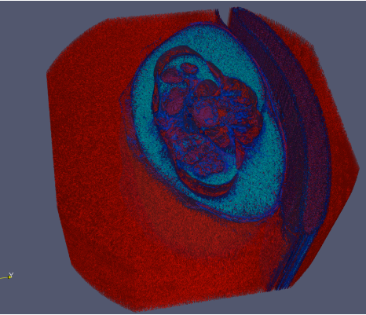

---
elm:
  dependencies:
    gicentre/elm-vegalite: latest

narrative-schemas:
  - coursework
---

Author: Edward Taylor, 976335

{(aim|}The aim of this visualisation is to show the complex structure of the pancreas and the internal organs and body tissue that surrounding it which makes it a complex part of the body.
{|aim)}

{(vistype|}The visualisation type used is an iso surface making use of multiple contour functions.
{|vistype)}

{(vismapping|}Multiple visual mappings were used to map different body parts do different colours. For example tissue was mapped to one colour (light blue) and the internal organs mapped to another and bone mapped to another.
Iso Surface mappings... -29000-> tissue, -10000-> perimeter of body, 10000 -> outside of body
. 
The jet transfer function was used to show color
{|vismapping)}

{(dataprep|}Data preparation required the data set being enlarged from its original scaling as it was far too small to work with.
{|dataprep)}

{(limitations|}The limitations of this visualisation is how cluttered and grainy the image can appear, this is due to lots of noise in the data which causes the grain so a clearer dataset would be ideal.
{|limitations)}

