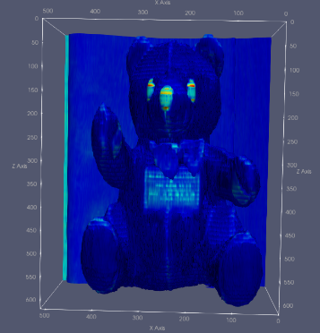

{(aim|}
This aim of this visualisation shows the object is a teddy bear. This is achieved by showing the areas of highest density change as an iso surface, these areas are the teddy’s eyes and nose as they are likely made out of a tougher material e.g. plastic. The visualisation also shows the teddy bear has a slightly denser chest area that appears to be in a rectangle, this is likely some sort of label, message etc. 
{|aim)}

{(vistype|}
The threshold visualisation function was used in this mapping with the minimum value set to 44 and the max set to 1462.
{|vistype)}

{(vismapping|}
For visual mappings I decided to use an isosurface, I then created a subset of the data and use this going forward in my visualisations, I selected the following data points for each axis, X: 20 -> 440, Y: 80 -> 430, Z: Unchanged. This helped to cut out some of the additional noise from the dataset so I could focus purely on the object in question. This had the added benefit of reducing processing time as a lot of the denser data points are behind the teddy.
.
I used the 'jet' transfer function to show the gradient changes and color
{|vismapping)}

{(dataprep|}
For data preparation I also used the transform function to increase the size of the Z axis by 10 times. This helped to make the teddy seem normally proportioned and not squashed.
{|dataprep)}

{(limitations|}
The visualisation only shows one iso surface as is a single threshold value so provides no insight as to what is inside the object.
{|limitations)}
