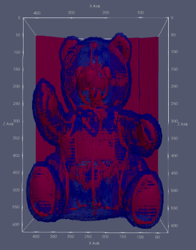

{(aim|}
This aim of this visulisation is to show the denser objects that are inside the teddy, past the low density outside. 
{|aim)}

{(vistype|}
The visual design shows how the teddy has been constructed as the denser points appear to be things such as stitching and tougher/denser structural materials for keeping the teddy in shape.
{|vistype)}

{(vismapping|}
The visual mapping uses two isosurface contour functions which were used to create two iso surfaced which were layered over each other so both could be seen. The outside layer shows outside the structure of the teddy bear and its fur this was achieved by setting the iso surface value to 44. The second contour function had a higher iso-value which was set to 170. To be able to see the inside layer I lowered the opacity on the outside iso surface to 0.4, this helped to clearly represent the second iso surface was inside the first and had a similar general structure.
.
The ject transfer function was used to show the iso surface's color
{|vismapping)}

{(dataprep|}
For data preparation I once again decided to create a subset of the data and use this going forward in my visualisations, I selected the following data points for each axis, X: 20 -> 440, Y: 80 -> 430, Z: Unchanged. This helped to cut out some of the additional noise from the dataset so I could focus purely on the object in question. This had the added benefit of reducing processing time as a lot of the denser data points are behind the teddy.
.
I also used the transform function again to increase the size of the Z axis by 10 times. This helped to make the teddy seem normally proportioned and not squashed.
{|dataprep)}

{(limitations|}
It would be helpful to remove some of the additional noise from the dataset, this would help to create smoother surfaces on the denser objects and make its structure even more clear.
{|limitations)}
