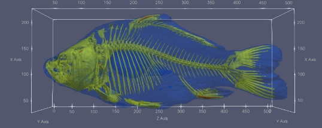

{(aim|}
This aim of this visualisation is to show the internals of the fish, and what makes up its body structure. This helps the user understand where different key body parts are such as bones are cartilage and even the organs.
{|aim)}

{(vistype|}
Multiple isosurfaces were created using the contour function to show multiple layers of the fishes internals
{|vistype)}

{(vismapping|}
The visual mapping is a contour functions to show three different densities and then layered their iso-surfaces to create an image detailing the insides of the fish. These three iso surfaces mapped to following: 
400 -> Skin, 2000 -> Cartilage, 1250 -> Bone.
.
The jet transfer function was used to show each iso surface color
{|vismapping)}

{(dataprep|}
For data preparation I also lowered the opacity on the data and each iso surface and set each to a distinct colour so all three could be clearly seen at the same. I also added data metrics to show how the size of each axis which helped to visulise the size of the object and the changes that took place.
{|dataprep)}

{(limitations|}
This visualisation could be improved by making the inside organs (that are the same density as skin) to stand out more clearly as they are sometimes difficult to clearly distinguish.
{|limitations)}
