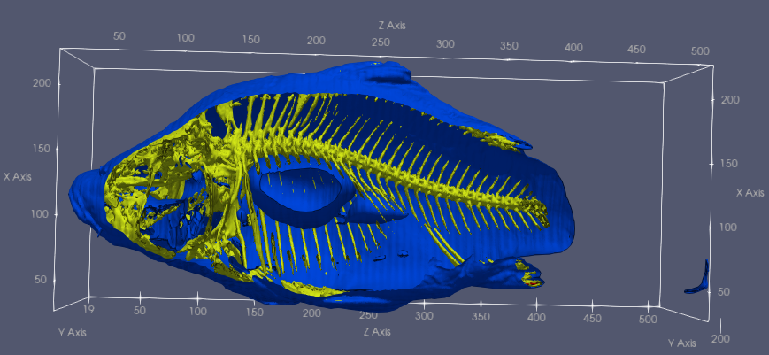

{(aim|}
The aim of this visualisation is to show the size of the internal organs of the fish. This is achieved by slicing through the fish and its organs to show the inside of the organs.
{|aim)}

{(vistype|}
Slice mapping feature edges show the inside of the fish’s organs.
{|vistype)}

{(vismapping|}
The visual mapping is achieved through using the slice and feature edge’s function which helped to show the edges of the organs and therefore offer insight into their size and composition.
.
Iso surfave values are set to 400 -> Skin, 2000 -> Cartilage, 1250 -> Bone.
.
The slice occurs at y=168.
.
The jet transfer function was used to show the iso surface colors
{|vismapping)}

{(dataprep|}
For data preparation I sliced the dataset in two along the Y axis. I also lowered the opacity on the data and each iso surface and set each to a distinct colour so all three could be clearly seen at the same.
{|dataprep)}

{(limitations|}
The visualisation could be improved by showing the individual organs more clearly, it can be confusing which organ is which when a single slice is used.
{|limitations)}
